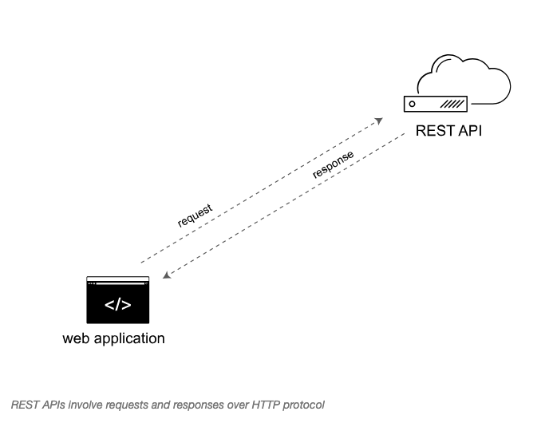

# Course Info

## Documenting APIs: A guide for technical writers and engineers

### https://idratherbewriting.com/learnapidoc/

Course designed to teach technical writers how to document *APIs* by creating a simple weather app. 

## About Rest APIs

A type of web API involving requests and responses. A user makes a request to a resource stored on a server, and then the server responds with the requested information. The protocol used to transport this data is HTTP and **REST** stands for *Representational State Transfer*.

## From Practice to Documentation 

This course provides hands-on experience from the API Developer point of view before shifting into how a technical writer documents API endpoints and other REST API topics. Discussion is given to each element a technical writer must reference with REST API documentation:
- Resource descriptions
- Endpoints and methods
- Parameters
- Request example
- Response example

Discussion on conceptual matters surrounding API documentation such as how to get started, how to perform a product overview, how to document status and error codes, how to request authorization, etc.. 

In addition, we will discuss the various was to publish REST API documentation, tools such as *GitHub*, static site generators like *Jekyll*, and other docs-as-code approaches. We will cover how to leverage templates, build interactive API consoles for users to test the request and response cycle. Also, we will discuss version control, and how we can manage our work with respect to it.  

The course will cover specifications like the *OpenAPI Specification* and *Swagger UI* (provides tooling for the OpenAPI specification); in addition, instruction in how to document *native library APIs* and generate *Javadoc*.

The essential project management skills of technical writing, how to manage documentation projects of various sizes, how to collect documentation feedback, keeping stakeholders happy, etc..

Included is a section on *metrics and measurements*, listing a comprehensive *quality guide*, allowing one to evaluate their project against industry best practices. 

## Course Organization

- Course Overview
- Chapter 1: Introduction to REST APIs
- Chapter 2: Using an API Like a Developer
- Chapter 3: Documenting API Endpoints
- Chapter 4: OpenAPI Spec and Generated Reference Docs
- Chapter 5: Step-by-Step OpenAPI Code Tutorial
- Chapter 6: Testing API Docs
- Chapter 7: Conceptual Topics in API Docs
- Chapter 8: Code Tutorials
- Chapter 9: The Writing Process
- Chapter 10: Publishing API Docs
- Chapter 11: Publishing Tools
- Chapter 12: Thriving in the API Doc Space
- Chapter 13: Library-Based APIs
- Chapter 14: Processess and Methodology
- Chapter 15: Metrics and Measurement
- Chapter 16: Glossary
- Chapter 17: Additional Resources